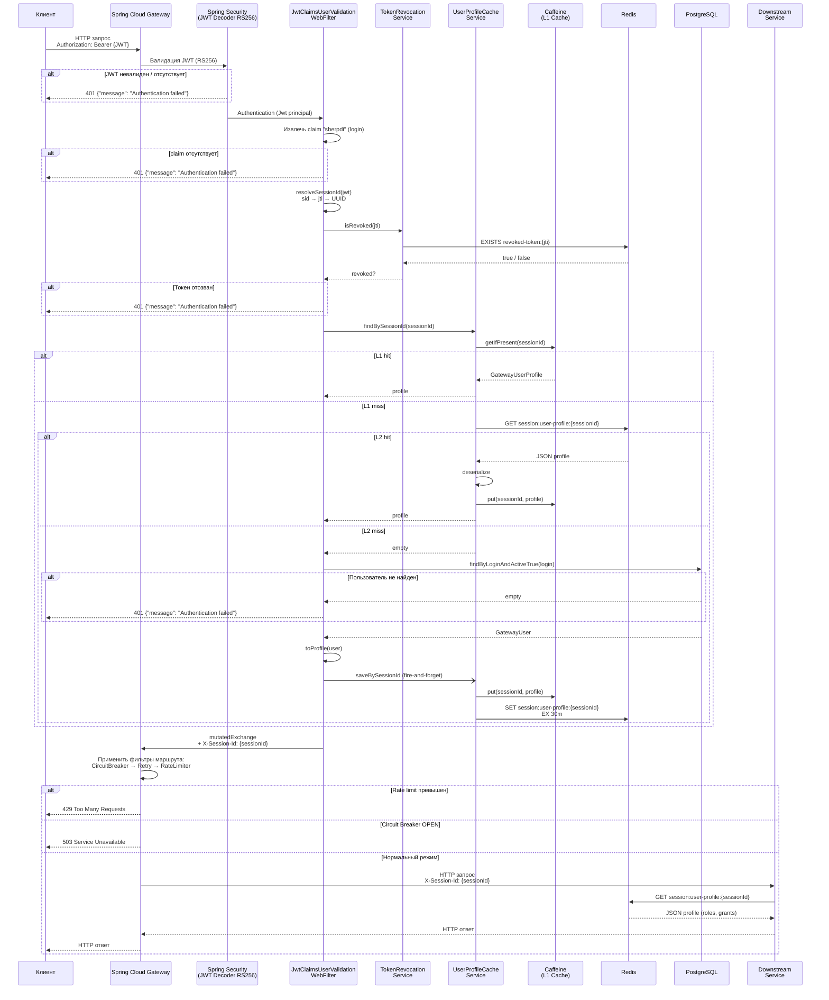
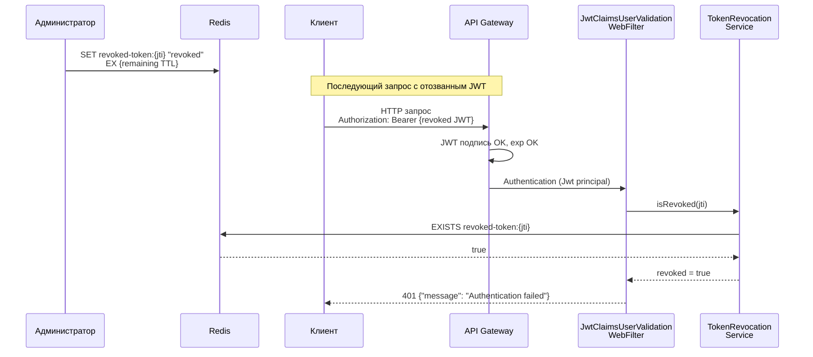
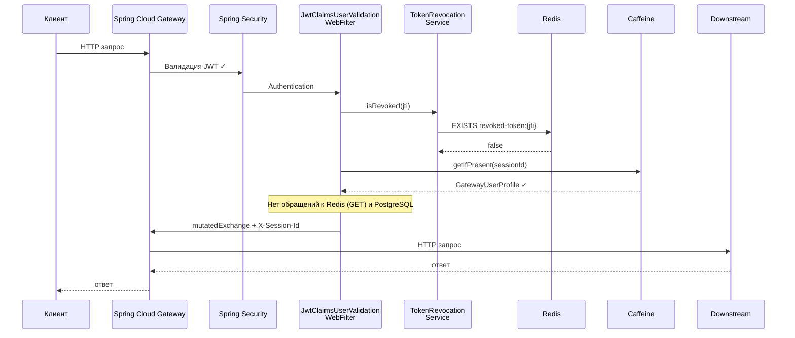
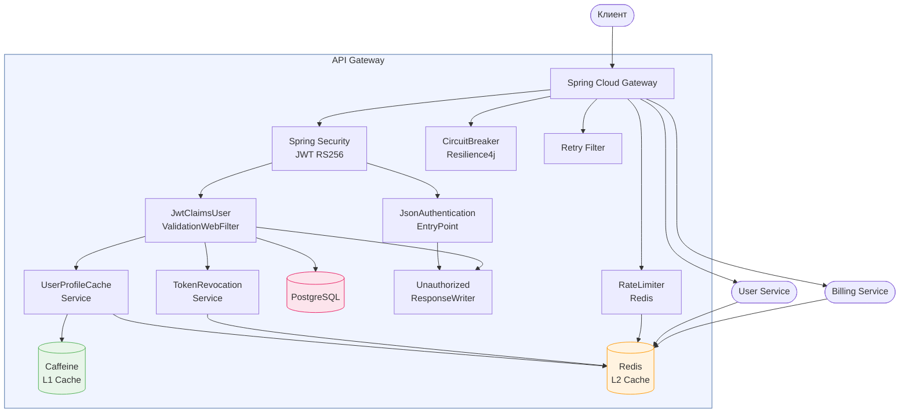

# Диаграмма последовательности: bio4j-api-gateway

## Основной поток (UC-01): авторизованный запрос

## Поток отзыва токена (UC-07)

## Поток с попаданием в L1-кеш (оптимальный путь)

## Обзор компонентов и их взаимодействия

